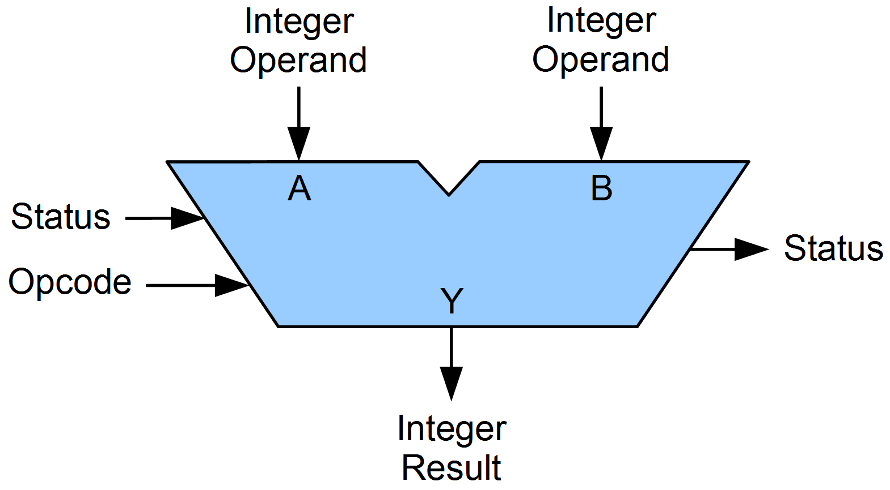
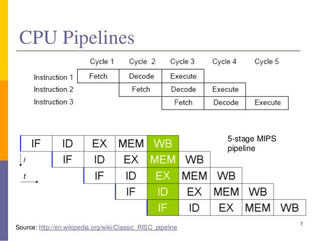

A computer is a data processor

* Read data from memory
* Transform it
* Write data to memory

#How is it layed out?

* FSB = Front side bus
* North/South bridge

#The bus

* Highway for data
* Shared between all the devices
* Bidirectional

#The CPU

* Made of components
* Different combination of those components

##The Control Unit

* Fetch instruction
* Decode instruction
* Coordinate other components

##Registers

* Memory
* Closest to the CPU
* Very fast but very few
* General purpose
* Specialized ( Instruction pointer, stack, status, ... )

##Arithmetic Logical Unit

* Integer only
* Arithmetic : Add / Sub / Mul / Div / Negate
* Bitwise logical : And / Or / Xor / Not
* Bit shift : Arithmetic / logical / rotate

##ALU

##Floating Point Unit

* Similar to ALU, but with floating points
* Separated for performance
* On x86, stack based machine

##Vector Unit

* SIMD (Single instruction multiple data)
* Has a specific set of Registers

##Memory Management Unit (MMU)

* Convert logical address to physical address
* Allow for more memory than pointer size ( 32bit = 4GB Max)
* Fragmentation avoidance
* Protection between process
* Paging / Direct addressing / Swapping

##MMU

* Translation Lookaside Buffer (TLB)
* Manage by the OS
* One per process
* Lookup is made by the hardware

##MMU Usage

* Lookup an address through process TLB
* If page is not assigned, interrupt OS
  * OS allocates and assign physical page to virtual space
* Convert logical to physical
* Returns to execution

##TLB Other examples

* Flush page to disk to free memory (swapping)
* View of a file on disk (File memory map)
* Bit in address with special meaning ( cached, write combined, ...)

##Caches

* Hierarchical
* The closer to the CPU
  * The fastest
  * The smallest
* Usually 2 to 3 levels

###Why Caches

* 1 CPU cycle = 0.5ns (10^-9s)
* Main memory reference 100ns
* 200 CPU cycle for one memory access

###Typical configuration

* Each core
  * 2 L1 caches, 1 for code, 1 for data ( 2x 32KB)
  * 1 L2 cache (2MB)
* Shared amongst core
  * L3 cache ( 8MB )

###Behavior

* CPU read L1 caches
* If miss, read L2
* If miss, read Main memory

###Behavior

* CPU writes L1 cache
* L1 line is written back to L2
* L2 line is written back to main memory

###Behavior

* What happens if another core has written the line?
* What happens if only one byte is needed?
* What happens if 2 core uses 2 bytes on the same line at the same time?

<!-- .slide: class="smaller_text" -->
### Xbox one timing

| Memory access result | Cycles | Notes
| ---- | ---- | ---- |
| L1 hit | 3 | Required line is in this core’s L1|
|L2 hit | 17 | Required line is in this module’s L2|
|Remote L2 hit, remote L1 miss | 100 | Required line is in the other module’s L2 |
|Remote L2 hit, remote L1 hit | 120 | Required line is in the other module’s L2 & in remote core’s L1|
|Local L2 miss, remote L2 miss | 144-160 | Required line is not resident in any cache; load from memory|

### Xbox one cache description

|Cache | Policy | Ways | Set Size | Line Size | Sharing|
| ---- | -----  | ---- | -------- | ---------- | ------|
|L1 I | Read only | 2 | 256 | 64 bytes | Dedicated to 1 core|
|L1 D | Write-allocate, write-back | 8 | 64 | 64 bytes | Dedicated to 1 core|
|L2 | Write-allocate, write-back, inclusive | 16 | 2048 | 64 bytes | Shared by module|

### Associativity

* Caches works with partial address ( low-part )
* A set maps to that partial address
* Ways correspond at how many lines can be saved in a set
* 8 Ways x 64 sets x 64 bytes = 32KB

### Associativity

* Trade off
* If you access 10 different memory address mapping the same cache line
    * Memory lines fight for cache space

<!-- .slide: class="smaller_text" -->
### Timings
| | Duration |  |
|---|---|---|
|L1 Cache reference | 0.5ns | 1s|
|Branch mispredict | 5ns | 10s|
|L2 Cache Reference | 7ns | 14s|
|Mutex Lock/Unlock | 25ns | 50s |
|Main Memory Reference | 100ns | 3min |
|Compress 1KB with Zippy| 3000ns | 100min|
|Read 4KB from SSD|150us | 83h|
|Read 1MB from Main memory|250us| 138h|
|Read 1MB from SSD|1000us| 23d|
|Disk seek| 10.000us| 230d|
|Read 1MB from HD|20.000us| 1.25y|
|Ping CA->Bel->CA| 150.000us | 9.5y|

##Instruction Processing

* Instruction Fetch
* Instruction Decode
* Execution
* Memory access
* Register Write back

##Pipeline

* One action per cycle
* Result in one instruction per 5 Cycles
* Solution pipeline

##Pipeline

##Pipeline

* Branch mispredictions
* Still wait for memory
* More complex on most CPU

#CPU Types

* RISC vs CISC

#CPU Types

* Complex Instruction Set CPU
* Reduced Instruction Set CPU

##RISC CPU
* simpler
* consume less energy
* fixed size instruction set
* instruction execution is faster but does less
* ARM ( used on phones ), PowerPc ( Xbox 360, PS3 )

##CISC CPU
* more complex, more transistor, more expensive
* more versatile
* variable size instruction set
* instruction execution is slower, but does a lot more
* X86(_64)

##What is an instruction

* Opcode (operation code)
* Binary string, encoding operation
* Built to allow fast decoding

##RISC instruction

##CISC instruction

##CISC Instructions

* Not executed as is
* Split in micro instruction
* Allow reordering of actions
* Multiple instances of registers
* Usually has fewer registers
