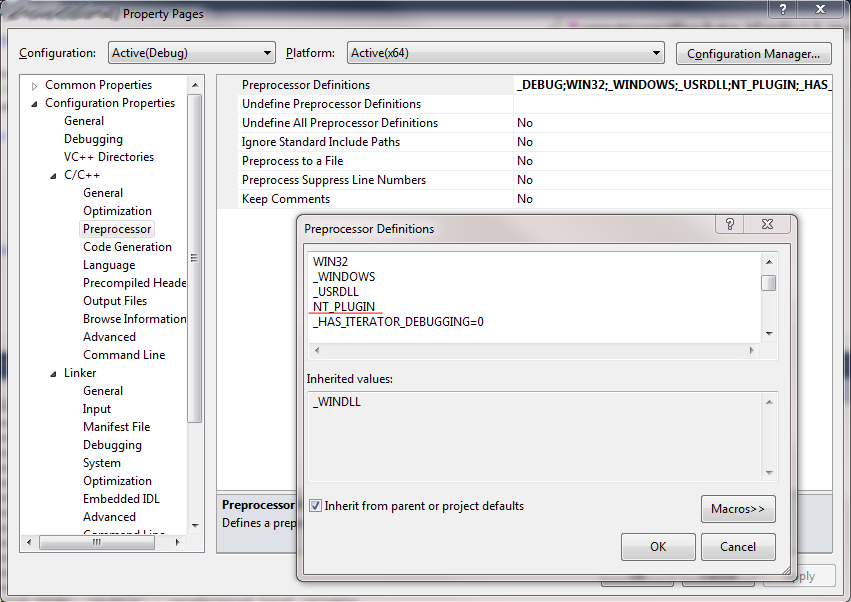

## Take homework sample

Try to run in on a windows pc.


### Several problems:

* There is no .sln file
* Unknown includes
* Unknown function calls


## Cross platform programming

**1 frontend, multiple backends**

_The user should not write platform specific code_


### Solution 1: Virtuality

* Graphics platform
* Sound system

**Exercise:**
Write a simple program that accepts the following syntax:
`myprogram --backend="xx_renderer"`
You support a green console renderer and a red console renderer.
The program's output should be:
`Look mom! I'm colored text!`

Implement those backends using virtuality.

### Advantages of using virtuality

* Switch backends from command line ( or launcher )
* Clear code structure Base > Backend 1 or Base > Backend 2


## Drawbacks of using virtuality

* More Expensive. ( Julien will cover this topic )
* Need to know about each backend on each platform
* What if the choice is obvious ( file system backend )


## Solution 2: Platform specific code

It would be nice if we could have code that only compiles on a given platform.


## Writing Platform specific code

The 4 stages of compiling:

* Preprocessing
* Compiling
* Assembling
* Linking

| Preprocessing | Interpreting preprocessor commands ( # ), stripping comments, ..     |
| :------------ | :------------- |
| Compiling     | Translation C/C++ to assembly       |
| Assembling    | Assembling the assembly to _object code_ ( obj ) |
| Linking       | Adds missing code ( system functions ) and combines the obj files.|


## Use of the Preprocessor to write Platform specific code

`#if` and `#ifdef`

Difference?
`#if` checks against true/false, `#ifdef` checks against a _defined_ property

```cpp
#define FOO false

#ifdef FOO // true
#endif
#if FOO // false
#endif
```


### Multiple conditions

This will not work:
```cpp
#ifdef FOO || BAR
#else
#endif
```

Instead:

```cpp
#if defined(FOO) || defined(BAR)
#else
#endif
```


## Setting preprocessor defines
`g++ main.cpp -D PLATFORM_Linux`

or

`MSBuild project.vcxproj /D PLATFORM_Windows`




## Exercise

Convert the linux file sample so that it works on windows too.
* Don't keep everything in 1 file. Make a class tor actions on the filesystem
* Use preprocessor defines to have platform specific code
* Test the solution on windows for now.


## Advantages of using preprocessor defines

* Only the required code is compiled per platform
* No virtuality


## Drawbacks of using preprocessor defines

* Not possible to switch after compilation
* Code is cluttered. no clear structure.


## Let's make it more structured

1 common header file, multiple implementations.

```cpp
// file_system.h
#pragma once

class file_system {
public:
    /* rest of class definition */
    static void Open(/*args*/);
    static void Close(/*args*/);
};
```

```cpp
// file_system.cpp
#include "file_system.h"

#if defined(PLATFORM_Windows)
    #include "file_system_windows.hpp"
#elif defined(PLATFORM_Linux)
    #include "file_system_linux.hpp"
#else
    #include "file_system_stub.hpp"
#endif
```

## Need platform specific includes or member variables?

No problem!
```cpp
// file_system.h
#pragma once

#if defined(PLATFORM_Windows)
    #include "file_system_windows_references.h"
#end

class file_system {
    /* rest of class definition */
private:
    // rest of member variables
    #if defined(PLATFORM_Windows)
        #include "file_system_windows_members.h"
    #end
};
```

```cpp
// file_system_windows_references.h
#include <windows.h>
```

```cpp
// file_system_windows_members.h
private:
    HANDLE m_Handle;
```
