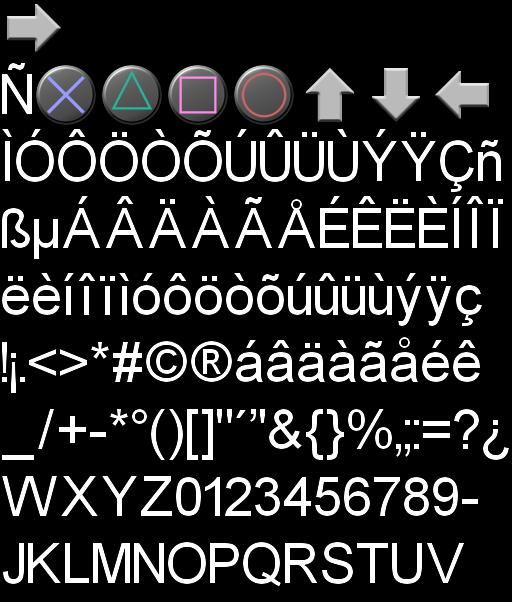

# Certification Process


##What is certification?

Phase in the submission process that ensures the software is of good quality


##What is certification?

Technical Requirements Checklist (TRC)

List of requirements that should be verified by the developer before submission


##TRC

- Specific to each console (iOs/Mac have similar process)
- Usually cover all the areas of development
- Ensure the best experience for all users
- Ensure the safety of the console ( exploit )
- Ensure the integrity of the hardware
- In the past, there was no update


##Obvious requirements?

- Some are ( The game should not crash )
- Some are easy ( Use version X.X.X of software Y )
- Some are tricky ( Write at maximum one time per second on save media )
- Some are boring ( Display a given interface for a given event )


##Version and software

- Console games usually comes with latest os
- OS evolves, exploits are fixed, new functionality are added
- Different components have different version ( network, achievements, ... )


##Version and software

- Rules for licensed software
    - middleware
    - open source license


##Stability

- The game should run without crashing for 4 hours
- The game should have a demo mode
- The game should run for 24 hours


##Stability : How to plan

- Main reason for crash over time : MEMORY
    - Leaks
    - Fragmentation


##Stability : How to plan

- Run early on target memory budget
    - Not graphic resources
    - C++ code uses only a fragment of total memory
    - Yet, it's this code that have issues with memory


##Stability : How to plan

- Leaks
    - Use automatic technique when possible
    - Smart pointer (std::unique_ptr, std::shared_ptr or roll your own)
    - Use symmetry in code


##Stability : How to plan (Leaks)

- Use automatic technique
```
Object * a = new Object[4]; //can leak
std::vector<Object> a; a.resize(4);
```
    - Do not transfer raw buffers ( allocated with new or malloc ?)
        - Provide abstraction for buffers
        - Think about ownership


##Stability : How to plan (Leaks)

- Smart pointer
    - Explicit ownership ( Strong, weak refs, uniquely owned )
    - Contract in the signature


##Stability : How to plan (Leaks)

```
shared_ptr<Wall> createWall(...);
unique_ptr<Door> createDoor(...);
void useDoor( const Door & );
void assignDoor( unique_ptr<Door> );
```


##Stability : How to plan (Leaks)

Symmetry

```
class Buffer
{
    void Initialize( int size ){ mBuffer = malloc( size ); }
    void Finalize(){ free(mBuffer); }
};
```


##Stability : How to plan (Leaks)

- Attention to cycles
- Attention to chain of destruction


##Stability : How to plan (Fragmentation)

- What is Fragmentation?
- How it happens?


##Stability : How to plan (Fragmentation)

- Group allocation by size (e.g small object allocator)
- Group allocation by system
- Limit noise traffic


##Stability : How to plan (Fragmentation)

- Custom allocator (Fixed-size pool, stack allocator, ...)
- Split transient and persistent
- Inspect statistics


##Stability : Testing

- Test early
- Test often
- Automatic test (bot, monkey test)


##Stability : 4-24 hours

- How? Run short games
    - Loading is memory intensive
    - Run different modes
    - Test bots on test machines


##Stability : Monkey bots

- Randomly press keys/buttons
- Can be simulated in software
- Can also be made hardware.


##Stability : Timing

- Simulate hardware delay
    - File reads
    - Network latency
    - ...
```
#if LATENCY_TEST
    delay( random( 0, 250 ) );
#endif
```


##Stability : Timing

- Use random timestep
- Run without graphics to speed the game
- Combine all techniques


##I/O Requirements

- Usually the worst technically
- Really need to be planned in advance
- READ THEM BEFORE STARTING


##I/O Requirements

- Error reporting
    - Run I/O in a different thread from rendering
    - On error, it allows to display the message easily
    - Some error are recoverable (Put the disc back!)


##I/O Requirements

- Savegame management
    - Prevent the console from shutting down
    - Do not crash on savegame loads (might get tempered)
    - If possible, do not erase previous save before success on current one.


##I/O Requirements

- Savegame management
    - No stealth save
    - Display symbol if save is seamless
    - Display should start before access and be removed after the write is finished


## I/O Requirements

- Limitation on the hardware
    - Do not exceed head movement in CD/DVD drive
    - Excessive write to flash can be destructive
    - Fortunately, no more 2Mb memory cards


##I/O Requirements

- Message are standard, from the constructor
- They should be localized
- Check for error management state chart in the documents


##Hardware protection

- Rumble should not last too long
- Rumble should be stopped on pause
- Flash drive, DVD drive limitations


##Conformance

- Do not change any platform button behavior
- All menus should be consistent with the console
- Accept/Back button should be correct
- Can change with territory


##Conformance: How to plan

- Virtual button
    - Enter button, not A
    - Back button, not Triangle
- Remap with platform / territory


##Conformance: How to plan

- Use localisation system
    - Use bitmap fonts with button
    - Assign foreign character to button
    - Use inclusion for menu


##Conformance : Use bitmap fonts




##Conformance : Dictionnary

menu_en.json
```
{
    "MENU_BACK" : "${PLATFORM_BACK_BUTTON} Back",
    .....
}
```
menu_fr.json
```
{
    "MENU_BACK" : "${PLATFORM_BACK_BUTTON} Retour",
    .....
}
```


##Conformance : Dictionnary

platform_button.json
```
{
    "PLATFORM_BACK_BUTTON" : "\xxxx", //Utf8 code
    .....
}
```


##Networking

- Networking Rules
    - Usually as big as all other rules together
    - If you have a custom server, it requires another certification process


## Conclusion

- If tackle late, can be a real pain
- Usually, no stupid rules
- Plan ahead, Read ahead
