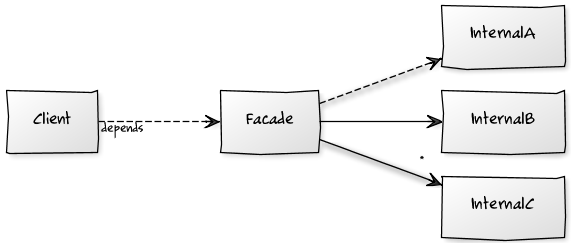
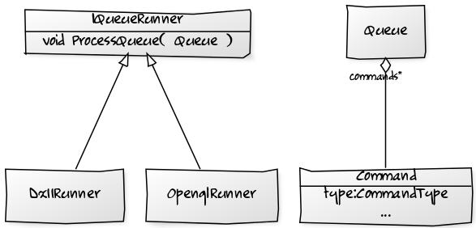

#Platform Abstraction


##Why?

- Different model
    - Object vs global (DX vs opengl)
    - Locking vs Non locking ( Metro files, network layer )
    - Different architecture (Sound system)


##How?

- ```#include``` trick (see course 2)
- Facade pattern
- Command Queue
- Promise / Future
- Handle


## Facade pattern




##Facade pattern

- Provides a simpler interface, easier to use, test and understand
- Hide the dependencies
- Allows to implement the system in different manner
- Hide complex or bad design in a better interface


##Command queue




##Command queue

- Only one virtual function (cheap price)
- Runner can run on another thread
- A queue can be processed while another one is created
- Multiple runners can run in parallel


##Promise / Future

- Decouple function call and result

```C++
std::future<Model> model = LoadModel( "hello" );
...

if( model.valid() ){
    model.get()....
}
```


##Promise / Future

- Perfect for asynchronous operations
- Doesn't have to be done on a thread
    - Slicing of a big task
    - Os async calls
    - Network request


##Handle

- Allow to hide specific class
- Allow reorganization inside the system
- Widely use


##Handle

- One implementation :

```
class Handle
{
    int index;
    int unique;
}
```


##Handle

```
class System
{
    private:

    X * GetFromHandle( const Handle & h )
    {
        if( ObjectTable[ h.index ].uniqueIndex == h.unique )
        {
            return ObjectTable[ h.index ].value;
        }

        return nullptr;
    }
};
```


##Handle

```
class System
{
    private:

    static int UniqueIndex = 0;

    Handle AddObject( X * v)
    {
        int index = GetFirstEmptyIndex();
        int unique = ++UniqueIndex;

        ObjectTable[ index ].uniqueIndex = unique;
        ObjectTable[ index ].value = v;

        return {index, unique};
    }
};
```
