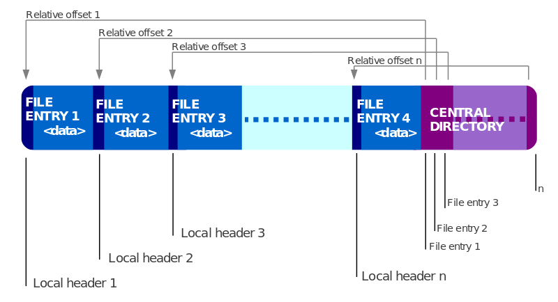

#Filesystem 2


##Archive and packs


##Why an archive?

- Single files are using more space (4kb min)
- Faster to deploy on target (both in dev and in prod)
- Allows compression of files
- No limit on file names
- Can be optimized in placement
- No file can be lost


##Examples

- General archives : zip, rar, 7z, ...
- Custom archives : pak
- Platform archives : ipa, apk


##Goal for today

- Read a zip
- Read a file (uncompressed)
- Use the Filesystem to access it


##Filesystem

```
class FileSystem
{    
    void MountArchive(const string & archive);
};
```


##Zip




##Zip

```
local file header signature     4 bytes  (0x04034b50)
version needed to extract       2 bytes
general purpose bit flag        2 bytes
compression method              2 bytes
last mod file time              2 bytes
last mod file date              2 bytes
crc-32                          4 bytes
compressed size                 4 bytes
uncompressed size               4 bytes
file name length                2 bytes
extra field length              2 bytes
```


##Zip

```
struct FileHeader
{
    int32_t signature;
    int16_t version;
    int16_t flags;
    int16_t compression;
    int16_t filetime;
    int16_t filedate;
    int32_t crc;
    int32_t compressed_size;
    int32_t uncompressed_size;
    int16_t filename_length;
    int16_t extra_field_length;
};
```


##Zip

```
#pragma pack(push, 1)
struct FileHeader
{
    int32_t signature;
    int16_t version;
    int16_t flags;
    int16_t compression;
    int16_t filetime;
    int16_t filedate;
    int32_t crc;
    int32_t compressed_size;
    int32_t uncompressed_size;
    int16_t filename_length;
    int16_t extra_field_length;
};
#pragma pack(pop)
```
